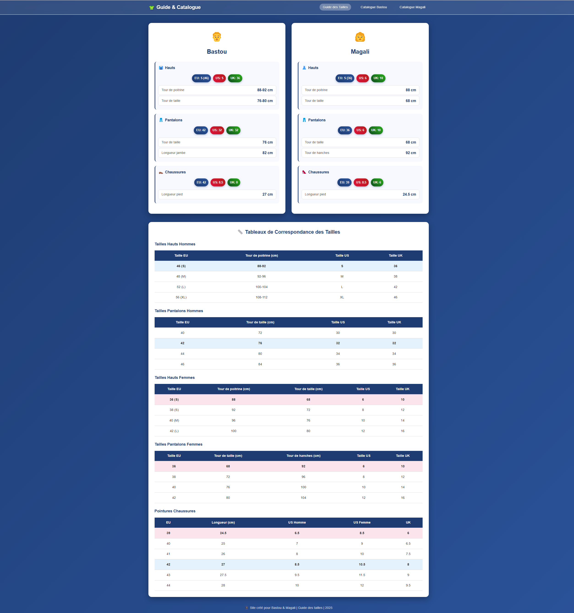
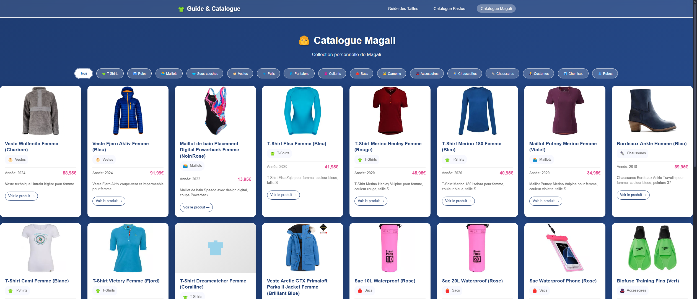

# 👔 Guide des Tailles & Catalogue de Vêtements

Site web personnel pour gérer les tailles et cataloguer les vêtements de Bastou et Magali.

## 🚀 Fonctionnalités

- **Guide des tailles** : Tableaux de correspondance EU/US/UK pour vêtements et chaussures
- **Profils personnalisés** : Tailles spécifiques pour Bastou et Magali
- **Catalogue de vêtements** : Collection organisée par catégories avec images
- **Navigation par URL** : Routes hash pour partager des liens directs
- **Responsive** : Optimisé mobile et desktop

## 📁 Structure

```
├── index.html              # Page principale
├── assets/
│   ├── css/
│   │   ├── main.css        # Styles principaux
│   │   └── responsive.css  # Styles responsive
│   ├── js/
│   │   ├── catalog.js      # Logique du catalogue
│   │   ├── navigation.js   # Navigation et routing
│   │   └── clothing-config.js # Configuration des vêtements
│   └── images/
│       ├── bastou/         # Images de Bastou
│       └── magali/         # Images de Magali
└── .kiro/specs/           # Documentation technique
```

## 🛠️ Installation

1. Cloner le projet
2. Ouvrir `index.html` dans un navigateur
3. Aucune dépendance externe requise

## ⚙️ Configuration

Pour ajouter des vêtements, modifier le fichier `assets/js/clothing-config.js` :

```javascript
{
  id: "unique-id",
  name: "Nom du vêtement",
  category: "techniques|costumes|chemises|robes|chaussures",
  owner: "bastou|magali",
  year: 2024,
  price: "99,99€",
  link: "https://...",
  images: ["assets/images/..."],
  description: "Description..."
}
```

## 🎯 Navigation

- `#guide` - Guide des tailles
- `#catalog-bastou` - Catalogue de Bastou
- `#catalog-magali` - Catalogue de Magali

## 📱 Compatibilité

- Chrome, Firefox, Safari, Edge
- Mobile et desktop
- Pas de JavaScript requis pour le guide des tailles

## 📸 Aperçu




